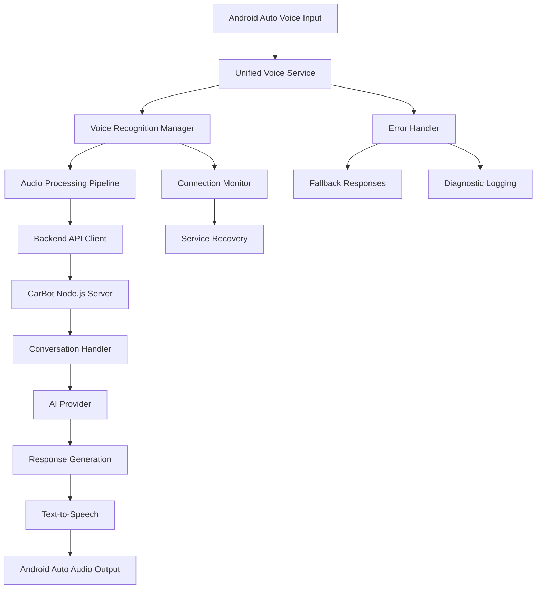

# Design Document

## Overview

The Google Assistant Android Auto integration issue stems from a breakdown in the voice processing pipeline after the initial greeting. The current implementation has multiple Android Auto services (AiCarBotService and CarBotService) with different approaches to voice handling, creating potential conflicts and communication gaps.

The solution involves consolidating the voice processing pipeline, implementing robust error handling and logging, and ensuring proper integration between Android Auto's voice services and the CarBot backend API.

## Architecture

### Current Architecture Issues

1. **Dual Service Implementation**: Both `AiCarBotService` (Car App API) and `CarBotService` (MediaBrowserService) exist with different voice handling approaches
2. **Inconsistent API Endpoints**: CarBotService uses `/api/wake-word` and `/api/voice-command` while CarBotApiClient uses `/api/voice`
3. **Missing Error Recovery**: No fallback mechanisms when voice processing fails
4. **Limited Logging**: Insufficient diagnostic information for troubleshooting

### Proposed Architecture



## Components and Interfaces

### 1. Unified Voice Service (Android)

**Purpose**: Single point of entry for all voice interactions in Android Auto

**Key Responsibilities**:
- Consolidate CarBotService and AiCarBotService functionality
- Handle Android Auto MediaBrowserService integration
- Manage voice activation and wake word detection
- Coordinate with VoiceRecognitionManager

**Interface**:
```kotlin
class UnifiedCarBotService : MediaBrowserServiceCompat() {
    fun handleVoiceActivation()
    fun processVoiceInput(audioData: ByteArray)
    fun displayResponse(message: String, type: ResponseType)
    fun handleError(error: VoiceError)
}
```

### 2. Enhanced Voice Recognition Manager

**Purpose**: Robust voice processing with comprehensive error handling

**Key Enhancements**:
- Timeout handling for speech recognition
- Retry mechanisms for failed recognition
- Audio quality validation
- Connection state monitoring

**Interface**:
```java
public class EnhancedVoiceRecognitionManager {
    public void startListeningWithTimeout(int timeoutMs)
    public void validateAudioInput()
    public void handleRecognitionTimeout()
    public void retryRecognition(int maxRetries)
}
```

### 3. Standardized API Client

**Purpose**: Consistent communication with CarBot backend

**Key Features**:
- Unified endpoint structure
- Request/response logging
- Connection pooling
- Automatic retry with exponential backoff

**Interface**:
```java
public class StandardizedApiClient {
    public CompletableFuture<ApiResponse> sendVoiceCommand(VoiceRequest request)
    public CompletableFuture<ApiResponse> triggerWakeWord()
    public void enableDiagnosticLogging(boolean enabled)
    public ConnectionStatus getConnectionStatus()
}
```

### 4. Backend API Standardization

**Purpose**: Consistent API endpoints and response formats

**Endpoints**:
- `POST /api/voice/wake-word` - Wake word activation
- `POST /api/voice/command` - Voice command processing
- `GET /api/voice/status` - Service health check
- `POST /api/voice/test` - Diagnostic testing

**Response Format**:
```json
{
  "success": boolean,
  "response": string,
  "audioUrl": string,
  "actions": array,
  "diagnostics": {
    "processingTime": number,
    "confidence": number,
    "errors": array
  }
}
```

### 5. Diagnostic and Logging System

**Purpose**: Comprehensive troubleshooting and monitoring

**Components**:
- Voice pipeline logging
- API request/response tracking
- Android Auto service state monitoring
- Performance metrics collection

## Data Models

### VoiceRequest
```json
{
  "command": "string",
  "audioData": "base64",
  "sessionId": "string",
  "timestamp": "ISO8601",
  "metadata": {
    "audioQuality": "number",
    "duration": "number",
    "source": "string"
  }
}
```

### VoiceResponse
```json
{
  "response": "string",
  "audioUrl": "string",
  "actions": [
    {
      "type": "string",
      "action": "string",
      "parameters": "object"
    }
  ],
  "sessionId": "string",
  "diagnostics": {
    "processingTime": "number",
    "confidence": "number",
    "aiProvider": "string",
    "errors": ["string"]
  }
}
```

### DiagnosticLog
```json
{
  "timestamp": "ISO8601",
  "level": "string",
  "component": "string",
  "message": "string",
  "data": "object",
  "sessionId": "string"
}
```

## Error Handling

### Error Categories

1. **Audio Input Errors**
   - Microphone not available
   - Poor audio quality
   - Background noise interference

2. **Recognition Errors**
   - Speech recognition timeout
   - No speech detected
   - Recognition service unavailable

3. **Network Errors**
   - Backend API unreachable
   - Request timeout
   - Invalid response format

4. **Android Auto Integration Errors**
   - Service disconnection
   - Audio output failure
   - Display update failure

### Error Recovery Strategies

1. **Graceful Degradation**
   - Fallback to text-based interaction
   - Simplified response format
   - Basic functionality maintenance

2. **Automatic Retry**
   - Exponential backoff for network requests
   - Speech recognition retry with adjusted parameters
   - Service reconnection attempts

3. **User Feedback**
   - Clear error messages
   - Suggested actions
   - Alternative interaction methods

## Testing Strategy

### Unit Testing

1. **Voice Recognition Manager Tests**
   - Audio input validation
   - Timeout handling
   - Error recovery mechanisms

2. **API Client Tests**
   - Request formatting
   - Response parsing
   - Connection handling

3. **Service Integration Tests**
   - Android Auto service lifecycle
   - Voice pipeline flow
   - Error propagation

### Integration Testing

1. **End-to-End Voice Flow**
   - Wake word → Recognition → API → Response → Audio output
   - Error scenarios and recovery
   - Performance under load

2. **Android Auto Compatibility**
   - Different Android Auto versions
   - Various car manufacturers
   - Network condition variations

### Diagnostic Testing

1. **Voice Quality Assessment**
   - Audio input quality metrics
   - Recognition accuracy measurement
   - Response time analysis

2. **System Health Monitoring**
   - Service availability checks
   - API endpoint health
   - Resource usage monitoring

## Implementation Phases

### Phase 1: Diagnostic Enhancement
- Implement comprehensive logging
- Add health check endpoints
- Create diagnostic tools

### Phase 2: Service Consolidation
- Merge CarBotService and AiCarBotService
- Standardize API endpoints
- Implement unified voice pipeline

### Phase 3: Error Handling
- Add timeout and retry mechanisms
- Implement fallback responses
- Create recovery procedures

### Phase 4: Testing and Validation
- Comprehensive testing suite
- Performance optimization
- User acceptance validation